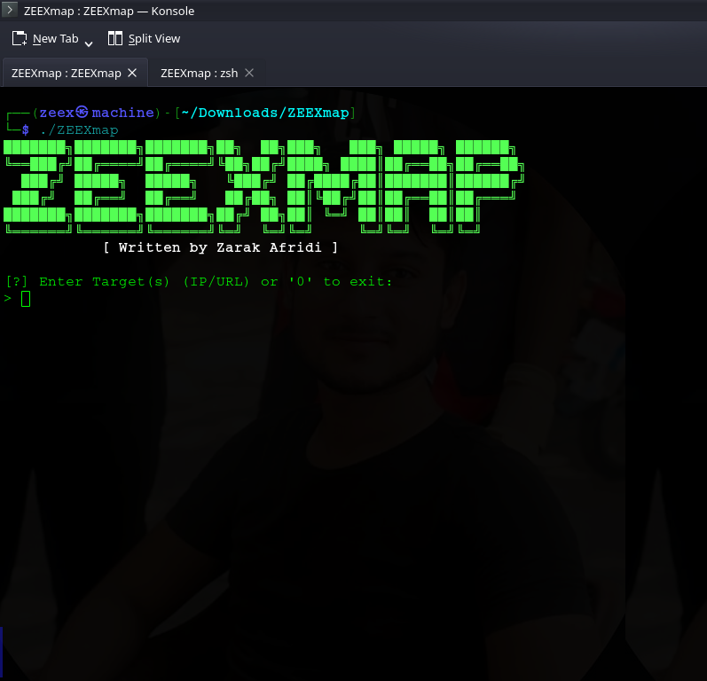
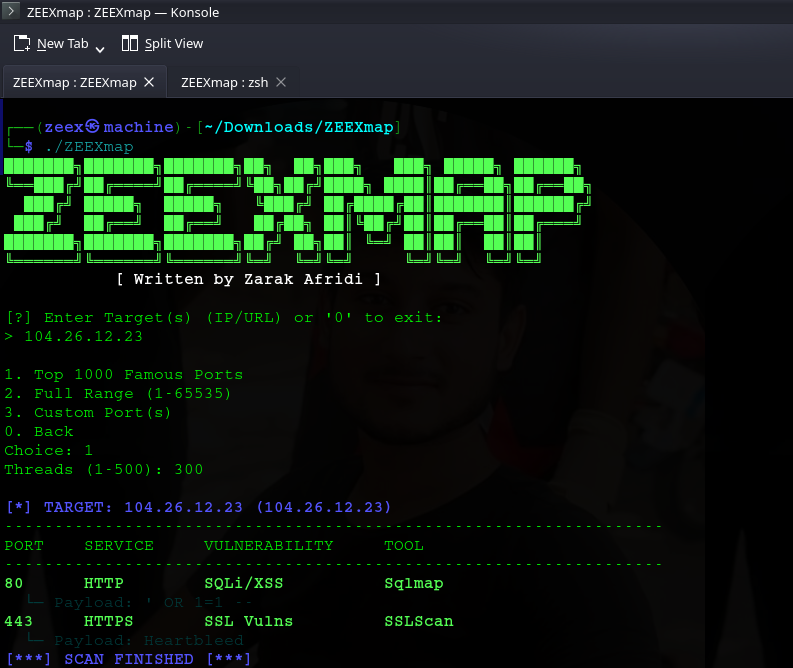

# 🛡️ ZEEXmap v7.7 (Elite Edition)
> **A high-speed, multi-threaded tactical port scanner for offensive security.**

Developed by **Zarak Afridi**.

---

## 🌟 Why ZEEXmap?
ZEEXmap is designed to be the go-to tool for both **Beginners** and **Advanced Security Professionals**. 

* **Beginner Friendly**: Unlike Nmap, which requires memorizing complex flags, ZEEXmap uses a **simple, interactive menu**. You just follow the prompts.
* **Professional Grade**: It provides raw speed with custom threading and a built-in **Tactical Database** that suggests the exact exploit tools (Metasploit, Sqlmap, etc.) for the ports you find.
* **Continuous Growth**: We are committed to this project. We will **modify and improve it over time**, adding new features like OS detection and banner grabbing.

---


## 📸 Screenshots

*Simple, easy-to-use interface compared to complex CLI tools.*


*Detailed vulnerability analysis and tactical tool suggestions.*

---

## 🚀 Key Features
* **Easier than Nmap**: No complex syntax—just follow the on-screen prompts.
* **Multi-threaded Engine**: User-defined threads (1-1000) for ultimate speed control.
* **Tactical Database**: Automatically identifies vulnerabilities and suggests the right tools.
* **Famous Port Scanning**: Built-in logic for the Top 1000 high-value ports.
* **Universal Compatibility**: Tested on Kali Linux, Arch, Termux, and Windows.

---

## 🛠️ Installation & Usage Guide

Follow the steps for your specific device to avoid errors.

### 🖥️ 1. Linux (Kali / Arch / Ubuntu / Parrot OS)
```bash
git clone https://github.com/sudozeek/ZEEXmap
cd ZEEXmap
make
./ZEEXmap

Gemini said
To make this foolproof for a first-time visitor, here is the complete, final version of the README.md and the exact steps to set it up on GitHub so your pictures and instructions show up perfectly.

Step 1: Create the README.md on GitHub
Go to your ZEEXmap repository on GitHub.

Click Add file -> Create new file.

Name it README.md.

Paste this complete content inside:

Markdown
# 🛡️ ZEEXmap v7.7 (Elite Edition)
> **A high-speed, multi-threaded tactical port scanner for offensive security.**

Developed by **Zarak Afridi**.

---

## 🌟 Why ZEEXmap?
ZEEXmap is designed to be the go-to tool for both **Beginners** and **Advanced Security Professionals**. 

* **Beginner Friendly**: Unlike Nmap, which requires memorizing complex flags, ZEEXmap uses a **simple, interactive menu**. You just follow the prompts.
* **Professional Grade**: It provides raw speed with custom threading and a built-in **Tactical Database** that suggests the exact exploit tools (Metasploit, Sqlmap, etc.) for the ports you find.
* **Continuous Growth**: We are committed to this project. We will **modify and improve it over time**, adding new features like OS detection and banner grabbing.

---


---


## 📸 Screenshots

*Simple, easy-to-use interface compared to complex CLI tools.*


*Detailed vulnerability analysis and tactical tool suggestions.*

---

---

## 🚀 Key Features
* **Easier than Nmap**: No complex syntax—just follow the on-screen prompts.
* **Multi-threaded Engine**: User-defined threads (1-1000) for ultimate speed control.
* **Tactical Database**: Automatically identifies vulnerabilities and suggests the right tools.
* **Famous Port Scanning**: Built-in logic for the Top 1000 high-value ports.
* **Universal Compatibility**: Tested on Kali Linux, Arch, Termux, and Windows.

---

## 🛠️ Installation & Usage Guide

Follow the steps for your specific device to avoid errors.

### 🖥️ 1. Linux (Kali / Arch / Ubuntu / Parrot OS)
```bash
git clone https://github.com/sudozeek/ZEEXmap
cd ZEEXmap
make
./ZEEXmap


📱 2. Android (Termux)

pkg update && pkg upgrade
pkg install git clang make
git clone https://github.com/sudozeek/ZEEXmap
cd ZEEXmap
make
./ZEEXmap


📖 How to Scan (Step-by-Step)
Target: Enter the IP (e.g., 192.168.1.1) or URL (e.g., google.com).

Mode: Select '1' for the Top 1000 Famous Ports.

Threads: Enter 100 for a fast, stable scan.

Results: Check the TOOL and PAYLOAD columns to see your next attack vector!

⚠️ Disclaimer: This tool is for educational purposes and authorized penetration testing only. Use it responsibly.
